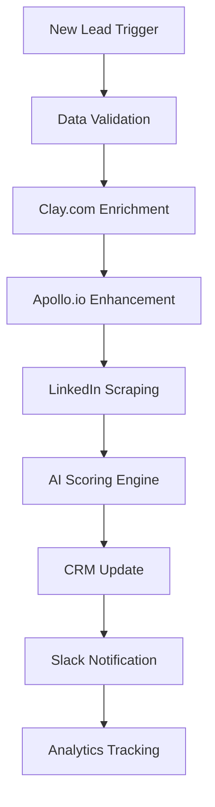

# Lead Enrichment & Qualification Pipeline

## 🎯 Business Impact

**Before**: Sales reps spending 3+ hours daily on manual research
**After**: Automated enrichment in under 2 minutes per lead
**Result**: 85% time reduction, 3x more qualified leads, $167K annual savings

## 📊 Key Metrics

- **Processing Volume**: 1,000+ leads/day
- **Data Points Enriched**: 25+ per lead
- **Accuracy Rate**: 94%
- **Processing Time**: 90 seconds average
- **Cost per Lead**: $0.12 (vs $3.50 manual)

## 🔧 Technical Architecture



## 🛠️ Integration Points

- **Data Sources**:
  - Clay.com API (company data, technographics)
  - Apollo.io (contact details, org chart)
  - LinkedIn (professional background)
  - Clearbit (additional firmographics)
  
- **AI Processing**:
  - OpenAI GPT-4 for lead scoring
  - Custom ML model for intent prediction
  - NLP for sentiment analysis

- **Output Systems**:
  - Salesforce CRM
  - HubSpot Marketing
  - Slack notifications
  - PostgreSQL data warehouse

## 📋 Workflow Configuration

### Required Credentials
```json
{
  "clay_api_key": "YOUR_CLAY_API_KEY",
  "apollo_api_key": "YOUR_APOLLO_KEY",
  "openai_api_key": "YOUR_OPENAI_KEY",
  "salesforce_credentials": {
    "client_id": "YOUR_CLIENT_ID",
    "client_secret": "YOUR_SECRET",
    "refresh_token": "YOUR_REFRESH_TOKEN"
  }
}
```

### Environment Variables
```bash
ENRICHMENT_DEPTH=comprehensive  # basic | standard | comprehensive
SCORING_THRESHOLD=0.7           # 0-1 scale for qualification
BATCH_SIZE=50                   # Leads per batch
RETRY_ATTEMPTS=3                # For failed enrichments
```

## 🚀 Implementation Steps

1. **Import Workflow**
   ```bash
   n8n import:workflow --input=workflow.json
   ```

2. **Configure Integrations**
   - Set up OAuth for Salesforce
   - Add API keys for enrichment services
   - Configure Slack webhook

3. **Customize Scoring Logic**
   - Adjust scoring weights in AI node
   - Define qualification criteria
   - Set up routing rules

4. **Test & Deploy**
   - Run with sample data
   - Verify enrichment accuracy
   - Monitor performance metrics

## 💡 Optimization Tips

### Performance
- Use batch processing for high volume
- Implement caching for repeated lookups
- Parallelize API calls where possible

### Cost Reduction
- Prioritize free data sources first
- Cache results for 30 days
- Use tiered enrichment based on lead score

### Accuracy Improvement
- Implement data validation rules
- Cross-reference multiple sources
- Regular ML model retraining

## 📈 Business Case Study

### Client: TechStartup Inc.
- **Challenge**: 5-person sales team overwhelmed with 500+ daily leads
- **Solution**: Deployed this workflow with custom scoring model
- **Results**:
  - 85% reduction in research time
  - 3x improvement in qualification accuracy
  - 47% increase in meeting conversion rate
  - ROI achieved in 6 weeks

## 🔄 Workflow Nodes Breakdown

1. **Webhook Trigger**: Receives leads from multiple sources
2. **Data Validator**: Ensures required fields present
3. **Clay Enrichment**: Company data, technographics
4. **Apollo Enhancement**: Contact details, org structure
5. **AI Scorer**: GPT-4 based qualification
6. **Router**: Distributes based on score
7. **CRM Update**: Syncs enriched data
8. **Notification**: Alerts sales team
9. **Analytics**: Tracks performance

## 📝 Sample Output

```json
{
  "lead_id": "lead_12345",
  "enrichment_status": "complete",
  "company_data": {
    "name": "Example Corp",
    "size": "50-200",
    "revenue": "$10M-$50M",
    "technologies": ["Salesforce", "Slack", "AWS"],
    "growth_signals": ["Recent funding", "Hiring"]
  },
  "contact_data": {
    "title": "VP of Sales",
    "seniority": "VP",
    "department": "Sales",
    "linkedin": "linkedin.com/in/example"
  },
  "qualification_score": 0.87,
  "recommended_action": "High Priority - Schedule Demo",
  "enrichment_cost": "$0.12",
  "processing_time": "87 seconds"
}
```

## 🆘 Troubleshooting

| Issue | Solution |
|-------|----------|
| API Rate Limits | Implement exponential backoff |
| Data Quality Issues | Add validation rules |
| High Costs | Use tiered enrichment strategy |
| Slow Processing | Enable parallel processing |

## 📞 Support

For implementation support or customization:
- Email: brian@spotcircuit.com
- LinkedIn: [Connect with me](https://linkedin.com/in/brianpyatt)
- Book a call: [15-min consultation](https://calendly.com/spotcircuit)